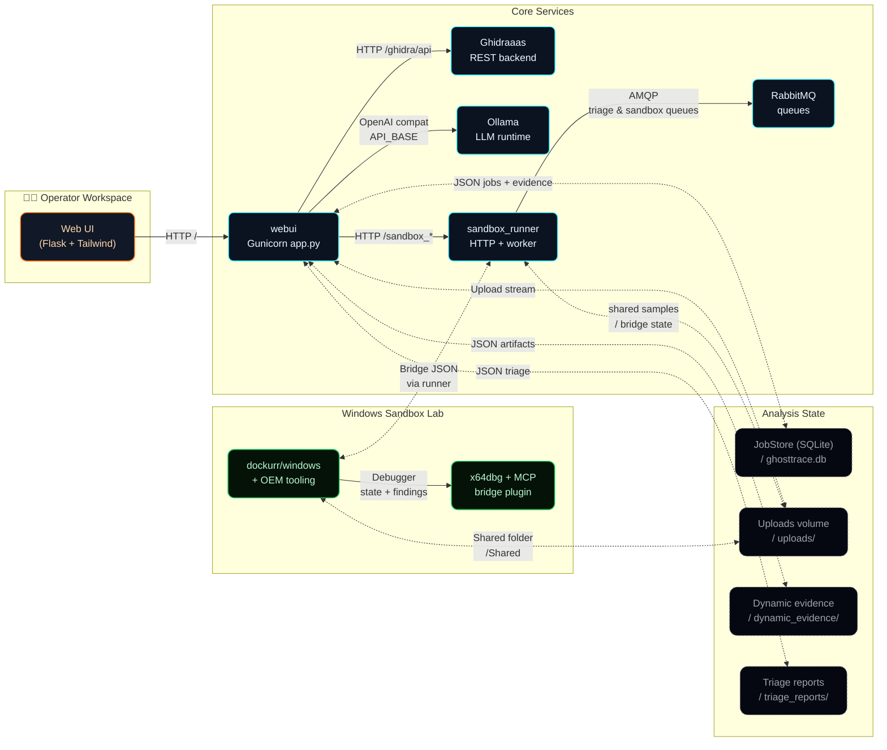
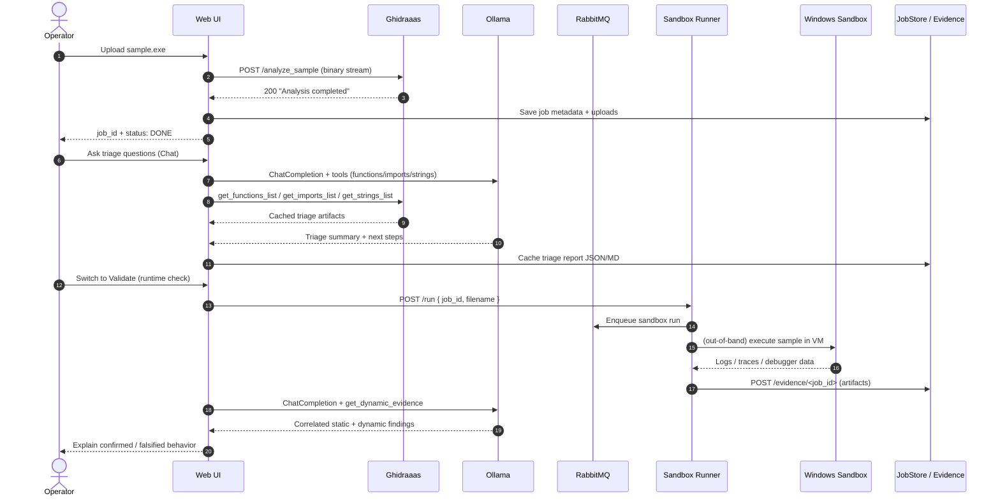

<div align="center">
  <h1>👻 GhostTrace</h1>
  <p><strong>Reverse engineering with operator-grade workflows, debugger context, sandbox trails, and less tab graveyard energy.</strong></p>
  <p><strong>Reverse engineering con flujos de operador de verdad, contexto de depuración, rastro de sandbox y menos vibra de cementerio de pestañas.</strong></p>
  <p>
    <a href="https://0xcyberberserker.github.io/ghosttrace-lab/"></a>
    
    
  </p>
  <p>
    
    
    
  </p>
  <p>
    Made with 🖤 in Barcelona City
    
  </p>
</div>

- [English](#english)
- [Español](#español)

---

## English

GhostTrace ties together a cyberpunk operator UI, `Ghidraaas` for static analysis, `Ollama` for local reasoning, cached triage artifacts, and a reproducible Windows sandbox lab with SSH and debugger bridge support.

### Highlights

- Static-analysis-first workflow powered by `Ghidraaas`
- Local LLM integration via `Ollama` and `Godmoded/llama3-lexi-uncensored`
- Cached imports, strings, functions, and decompilation
- Auto-generated triage reports per analysis job
- Persistent job management in the web UI
- Windows sandbox profile with `noVNC`, `RDP`, and `SSH`
- `x64dbg` bridge for debugger-aware workflows

### Responsibility Note

GhostTrace is built for legitimate reverse engineering, malware analysis, DFIR, research, and defensive engineering.

Like any serious binary-analysis stack, it can be misused. That decision belongs to the operator, not the project. If you point GhostTrace at targets, software, or environments without proper authorization, you own the legal, ethical, and operational consequences. Use it smart. Use it lawfully. Good hands. Better judgment.

Improvement ideas are always welcome, and thoughtful criticism will be taken seriously to keep sharpening the project.

### Architecture



Core components:

- `webui/`
  Flask application, job management, AI operator, chat, triage view, and debugger view.
- `Ghidraaas/`
  Cisco Talos Ghidra-as-a-Service backend adapted for this stack.
- `sandbox/`
  Windows sandbox provisioning, host-side SSH helpers, bridge tooling, and OEM automation.
- `docs/`
  Public landing page for GitHub Pages.

### Quick Start

1. Build `Ghidraaas`:

```powershell
cd Ghidraaas
docker build -t ghidraaas .
```

2. Start the stack from the repository root:

```powershell
docker compose up --build
```

The containerized `webui` runs behind `gunicorn` in the Compose stack. The Flask development server is still only for local direct execution.

Optional operator protection for the Web UI is available through HTTP Basic auth:

```text
OPERATOR_USERNAME=operator
OPERATOR_PASSWORD=change-me
```

If both variables are set, GhostTrace requires operator credentials for the human-facing Web UI and API routes, while internal sandbox-to-web callbacks still use the shared internal token path.

GhostTrace now also supports RabbitMQ-backed background workers in the Compose stack. The default setup starts `rabbitmq`, a dedicated `webui_worker` for triage, and a `sandbox_runner_worker` for sandbox run queue processing.

Both `webui` and `sandbox_runner` now expose an observability-friendly `/health` endpoint with request IDs and readiness details. Responses also include an `X-Request-ID` header so logs can be correlated across services.
The Web UI also exposes `/metrics/summary` for a JSON operator snapshot and `/metrics` for Prometheus-style text metrics.

The main `sandbox_runner` container now runs behind `gunicorn` as well. The bridge polling thread is only enabled in the HTTP-facing runner process, not in the separate queue worker, so the stack avoids duplicate bridge consumers.

Frontend assets no longer depend on runtime CDNs for Tailwind, jQuery, Marked, or Google Fonts. Generated and vendored frontend assets live under `webui/static/css/` and `webui/static/vendor/`.

If you change utility classes or refresh frontend vendor assets, regenerate them with:

```powershell
npm install
npm run build:frontend
```

For the new browser smoke check of the main shell, install Playwright Chromium once and then run:

```powershell
npx playwright install chromium
npm run test:e2e:smoke
npm run test:e2e:release
```

The smoke script expects the app at `http://127.0.0.1:5000/` by default and writes screenshots under `output/playwright/`.
It also writes a JSON report to `output/playwright/ghosttrace-smoke-report.json` with step timings, the opened job id, and a visible UI snapshot, and it fails if it detects actionable browser `pageerror` events or console errors.
The release check reads that report and fails if the total runtime, key lane timings, or final visible health state drift past configurable thresholds.

A baseline GitHub Actions CI workflow now covers frontend asset generation, Python compile checks, and the Web UI plus sandbox runner test suites. The browser smoke is kept separate for now because it still expects a live stack with at least one seeded analysis job.

3. Open the app:

```text
http://localhost:5000
```

### Requirements

- Docker Desktop
- enough disk space for the Ollama model

The stack now starts its own `ollama` container and automatically pulls:

```text
Godmoded/llama3-lexi-uncensored
```

`ollama` is configured to request all available Docker GPUs for inference.

### Shared AI Configuration

GhostTrace keeps its shared AI runtime settings in [`ai-config.json`](./ai-config.json).

Current defaults:

- provider: `ollama`
- API base: `http://ollama:11434/v1`
- model: `Godmoded/llama3-lexi-uncensored`
- local state DB: `/app/data/ghosttrace.db`

The repo is aligned so the same Ollama model is used on both sides:

- `webui` uses `MODEL_NAME=Godmoded/llama3-lexi-uncensored`
- `windows_sandbox` uses `OLLAMA_MODEL=Godmoded/llama3-lexi-uncensored`
- `docker-compose` wires Ollama internally as `http://ollama:11434`

### Analysis Workflow



### Roadmap and Benchmark Bench

- Roadmap: [`ROADMAP.md`](./ROADMAP.md)
- Benchmark bench: [`samples/benchmarks.md`](./samples/benchmarks.md)

### Auto Triage Reports

Endpoint:

```text
GET /triage/<job_id>
```

Artifacts:

- JSON: `/app/data/triage_reports/<job_id>.json`
- Markdown: `/app/data/triage_reports/<job_id>.md`

Behavior:

- triage is queued automatically after upload
- triage is regenerated when new dynamic evidence is added
- the endpoint returns `202` while required artifacts are still being prepared

To enable LLM-authored triage prose:

```text
TRIAGE_USE_LLM=1
```

### Dynamic Evidence Lane

GhostTrace does not autonomously execute unknown binaries as part of the default workflow. Instead, it supports structured evidence ingestion from controlled environments.

Endpoints:

```text
POST /evidence/<job_id>
GET  /evidence/<job_id>
```

This lets the platform correlate imports, strings, decompilation, sandbox artifacts, and debugger findings.

### Windows Sandbox Lab

The optional `windows-sandbox` profile provides:

- `noVNC` on `http://127.0.0.1:8006`
- `RDP` on `127.0.0.1:3389`
- `SSH` on `127.0.0.1:2222`
- shared samples through the `Shared` desktop folder

#### Local lab credentials

The optional Windows lab now uses:

- default username: `Docker`
- auto-generated password created at sandbox startup
- persisted credentials stored in `sandbox/credentials/windows-sandbox.env`

The password is generated by the `windows_sandbox` container itself at runtime and then exposed in the Web UI. That keeps the flow automatic without baking a static secret into the repo or requiring manual pre-steps.

If you ever want to pre-generate or rotate that file manually:

```powershell
python scripts/ensure_windows_sandbox_credentials.py
```

The Web UI loads and shows the generated lab credentials once the optional sandbox has started at least once.

The sandbox ports are bound to `127.0.0.1` by default:

- `noVNC` on `http://127.0.0.1:8006`
- `RDP` on `127.0.0.1:3389`
- `SSH` on `127.0.0.1:2222`

If you intentionally expose the sandbox beyond localhost, treat it as a privileged lab host and set unique credentials first.

### Host-Side Helpers

Windows helpers:

- [`Invoke-WindowsSandboxSSH.ps1`](./sandbox/host-tools/Invoke-WindowsSandboxSSH.ps1)
- [`Invoke-WindowsSandboxPS.ps1`](./sandbox/host-tools/Invoke-WindowsSandboxPS.ps1)
- [`Copy-ToWindowsSandbox.ps1`](./sandbox/host-tools/Copy-ToWindowsSandbox.ps1)
- [`Copy-FromWindowsSandbox.ps1`](./sandbox/host-tools/Copy-FromWindowsSandbox.ps1)

Generic helpers:

- [`Invoke-SandboxSSH.ps1`](./sandbox/host-tools/Invoke-SandboxSSH.ps1)
- [`Copy-ToSandbox.ps1`](./sandbox/host-tools/Copy-ToSandbox.ps1)
- [`Copy-FromSandbox.ps1`](./sandbox/host-tools/Copy-FromSandbox.ps1)

### Public Site

The landing page lives in [`docs/index.html`](./docs/index.html) and is published on GitHub Pages:

- [https://0xcyberberserker.github.io/ghosttrace-lab/](https://0xcyberberserker.github.io/ghosttrace-lab/)
- English: [https://0xcyberberserker.github.io/ghosttrace-lab/en/](https://0xcyberberserker.github.io/ghosttrace-lab/en/)
- Español: [https://0xcyberberserker.github.io/ghosttrace-lab/es/](https://0xcyberberserker.github.io/ghosttrace-lab/es/)

---

## Español

GhostTrace reúne una interfaz de operador con estética cyberpunk, `Ghidraaas` para análisis estático, `Ollama` para razonamiento local, artefactos de triage en caché y un laboratorio Windows reproducible con SSH y un puente de depuración.

### Puntos fuertes

- Flujo centrado en análisis estático apoyado por `Ghidraaas`
- Integración local con `Ollama` y `Godmoded/llama3-lexi-uncensored`
- Caché de imports, strings, funciones y decompilación
- Informes de triage automáticos por análisis
- Gestión persistente de trabajos en la interfaz
- Perfil de sandbox Windows con `noVNC`, `RDP` y `SSH`
- Puente de `x64dbg` para flujos de depuración asistida

### Nota de responsabilidad

GhostTrace está pensado para reverse engineering legítimo, análisis de malware, DFIR, investigación y trabajo defensivo.

Como cualquier stack serio de análisis binario, puede usarse mal. Esa decisión pertenece al operador, no al proyecto. Si apuntas GhostTrace contra objetivos, software o entornos sin la debida autorización, asumes toda la responsabilidad por las consecuencias legales, éticas y operativas. Úsalo con cabeza. Úsalo dentro de la ley. Buen pulso. Mejor criterio.

Cualquier idea de mejora será bienvenida, y toda crítica con criterio se tendrá en cuenta para seguir afilando el proyecto.

### Arquitectura

```text
Subida binaria -> Web UI -> Ghidraaas -> Artefactos cacheados -> AI Operator / Chat / Triage
                                         \-> Cola sandbox -> Laboratorio Windows -> Puente x64dbg
```

Componentes principales:

- `webui/`
  Aplicación Flask, gestión de trabajos, operador IA, chat, vista de triage y vista del depurador.
- `Ghidraaas/`
  Backend Ghidra-as-a-Service de Cisco Talos adaptado a este stack.
- `sandbox/`
  Aprovisionamiento de sandbox Windows, utilidades SSH desde el host, herramientas del puente y automatización OEM.
- `docs/`
  Landing pública para GitHub Pages.

### Puesta en marcha

1. Construye `Ghidraaas`:

```powershell
cd Ghidraaas
docker build -t ghidraaas .
```

2. Arranca el stack desde la raíz del repositorio:

```powershell
docker compose up --build
```

En el stack con Compose, `webui` arranca detrás de `gunicorn`. El servidor de desarrollo de Flask queda solo para ejecución local directa.

La Web UI admite protección opcional de operador con HTTP Basic auth:

```text
OPERATOR_USERNAME=operator
OPERATOR_PASSWORD=cambia-esto
```

Si defines ambas variables, GhostTrace pedirá credenciales de operador en las rutas humanas de la Web UI y de la API, mientras que las callbacks internas de la sandbox seguirán usando el token interno compartido.

GhostTrace también admite ahora workers en segundo plano con RabbitMQ dentro del stack de Compose. La configuración por defecto levanta `rabbitmq`, un consumidor dedicado `webui_worker` para triage y `sandbox_runner_worker` para procesar la cola de sandbox.

Además, `webui` y `sandbox_runner` exponen ahora un endpoint `/health` orientado a observabilidad, con detalles de readiness e IDs de petición. Las respuestas incluyen `X-Request-ID` para poder correlacionar logs entre servicios.
La Web UI también expone `/metrics/summary` como resumen JSON para operador y `/metrics` en formato de texto estilo Prometheus.

El contenedor principal de `sandbox_runner` también se ejecuta ahora detrás de `gunicorn`. El hilo del bridge solo se activa en el proceso HTTP del runner y no en el worker separado de la cola, así evitamos consumidores duplicados del bridge.

Los assets del frontend ya no dependen de CDNs en runtime para Tailwind, jQuery, Marked ni Google Fonts. Los assets generados y versionados viven en `webui/static/css/` y `webui/static/vendor/`.

Si cambias clases utility o quieres refrescar los vendor del frontend, regénéralos con:

```powershell
npm install
npm run build:frontend
```

3. Abre la app:

```text
http://localhost:5000
```

### Requisitos

- Docker Desktop
- espacio suficiente en disco para el modelo de Ollama

El stack ahora arranca su propio contenedor `ollama` y descarga automáticamente:

```text
Godmoded/llama3-lexi-uncensored
```

`ollama` queda configurado para pedir todas las GPU disponibles en Docker para la inferencia.

### Configuración compartida de IA

GhostTrace mantiene la configuración compartida en [`ai-config.json`](./ai-config.json).

Valores actuales:

- proveedor: `ollama`
- API base: `http://ollama:11434/v1`
- modelo: `Godmoded/llama3-lexi-uncensored`
- base local de estado: `/app/data/ghosttrace.db`

El repo está alineado para usar el mismo modelo en ambos lados:

- `webui` usa `MODEL_NAME=Godmoded/llama3-lexi-uncensored`
- `windows_sandbox` usa `OLLAMA_MODEL=Godmoded/llama3-lexi-uncensored`
- `docker-compose` conecta Ollama internamente como `http://ollama:11434`

### Flujo de análisis

- `Triage estático`
  Entender el propósito probable, los subsistemas sospechosos, el comportamiento del instalador y las rutas de código prioritarias.
- `Comportamiento PE / API`
  Usar imports y decompilación para razonar sobre registro, ficheros, servicios, criptografía y procesos.
- `Pistas de red`
  Sacar pistas de telemetría, actualización o comunicación remota a partir de evidencia estática.
- `Correlación dinámica`
  Mezclar hallazgos de la sandbox y del depurador sin perder el contexto del análisis estático.

### Hoja de ruta y banco de benchmarks

- Hoja de ruta: [`ROADMAP.md`](./ROADMAP.md)
- Banco de benchmarks: [`samples/benchmarks.md`](./samples/benchmarks.md)

### Informes automáticos de triage

Endpoint:

```text
GET /triage/<job_id>
```

Artefactos:

- JSON: `/app/data/triage_reports/<job_id>.json`
- Markdown: `/app/data/triage_reports/<job_id>.md`

Comportamiento:

- el triage se encola automáticamente tras la subida
- se regenera al añadir evidencia dinámica
- el endpoint devuelve `202` mientras falten artefactos necesarios

Para activar prosa de triage generada por LLM:

```text
TRIAGE_USE_LLM=1
```

### Canal de evidencia dinámica

GhostTrace no ejecuta binarios desconocidos automáticamente en el flujo por defecto. En su lugar, soporta ingestión estructurada de evidencia desde entornos controlados.

Endpoints:

```text
POST /evidence/<job_id>
GET  /evidence/<job_id>
```

Esto permite correlacionar imports, strings, decompilación, artefactos de sandbox y hallazgos del depurador.

### Laboratorio Windows

El perfil opcional `windows-sandbox` ofrece:

- `noVNC` en `http://127.0.0.1:8006`
- `RDP` en `127.0.0.1:3389`
- `SSH` en `127.0.0.1:2222`
- muestras compartidas a través de la carpeta `Shared`

#### Credenciales del laboratorio local

El laboratorio Windows opcional ahora usa:

- usuario por defecto: `Docker`
- contraseña autogenerada en el arranque de la sandbox
- credenciales persistidas en `sandbox/credentials/windows-sandbox.env`

La contraseña la genera la propia `windows_sandbox` en runtime y luego la muestra la Web UI. Así el flujo es automático sin dejar un secreto fijo en el repo ni depender de un paso manual previo.

Si alguna vez quieres generar o rotar ese archivo manualmente:

```powershell
python scripts/ensure_windows_sandbox_credentials.py
```

La Web UI carga y muestra esas credenciales una vez que la sandbox opcional se haya arrancado al menos una vez.

Los puertos de la sandbox quedan ligados a `127.0.0.1` por defecto:

- `noVNC` en `http://127.0.0.1:8006`
- `RDP` en `127.0.0.1:3389`
- `SSH` en `127.0.0.1:2222`

Si decides exponer la sandbox fuera de localhost, trátala como un host privilegiado de laboratorio y define primero credenciales únicas.

### Utilidades desde el host

Utilidades para Windows:

- [`Invoke-WindowsSandboxSSH.ps1`](./sandbox/host-tools/Invoke-WindowsSandboxSSH.ps1)
- [`Invoke-WindowsSandboxPS.ps1`](./sandbox/host-tools/Invoke-WindowsSandboxPS.ps1)
- [`Copy-ToWindowsSandbox.ps1`](./sandbox/host-tools/Copy-ToWindowsSandbox.ps1)
- [`Copy-FromWindowsSandbox.ps1`](./sandbox/host-tools/Copy-FromWindowsSandbox.ps1)

Utilidades genéricas:

- [`Invoke-SandboxSSH.ps1`](./sandbox/host-tools/Invoke-SandboxSSH.ps1)
- [`Copy-ToSandbox.ps1`](./sandbox/host-tools/Copy-ToSandbox.ps1)
- [`Copy-FromSandbox.ps1`](./sandbox/host-tools/Copy-FromSandbox.ps1)

### Web pública

La landing vive en [`docs/index.html`](./docs/index.html) y se publica en GitHub Pages:

- [https://0xcyberberserker.github.io/ghosttrace-lab/](https://0xcyberberserker.github.io/ghosttrace-lab/)
- Inglés: [https://0xcyberberserker.github.io/ghosttrace-lab/en/](https://0xcyberberserker.github.io/ghosttrace-lab/en/)
- Español: [https://0xcyberberserker.github.io/ghosttrace-lab/es/](https://0xcyberberserker.github.io/ghosttrace-lab/es/)
