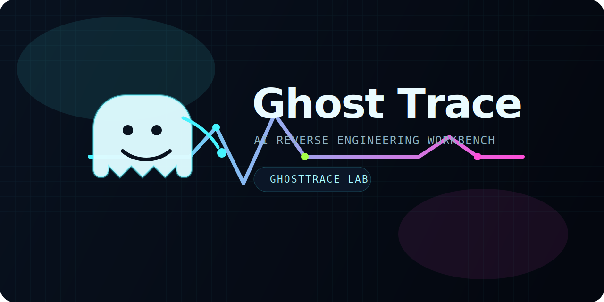

# GhostTrace



GhostTrace is an AI-assisted reverse engineering workbench for binary triage, guided decompilation, and sandbox-aware operator workflows.

It combines a cyberpunk web UI, `Ghidraaas` for static analysis, `Ollama` for local reasoning, cached triage artifacts, and a reproducible Windows sandbox lab with SSH and debugger bridge support.

## Highlights

- Static-analysis-first workflow powered by `Ghidraaas`
- Local LLM integration via `Ollama` and `qwen3-coder-next:latest`
- Cached imports, strings, functions, and decompilation
- Auto-generated triage reports per analysis job
- Persistent job management in the web UI
- Windows sandbox profile with `noVNC`, `RDP`, and `SSH`
- `x64dbg` bridge for debugger-aware workflows

## Architecture

```text
Binary Upload -> Web UI -> Ghidraaas -> Cached Artifacts -> AI Operator / Chat / Triage
                                      \-> Sandbox Queue -> Windows Lab -> x64dbg Bridge
```

Core components:

- `webui/`
  Flask application, job management, AI operator, chat, triage view, and debugger view.
- `Ghidraaas/`
  Cisco Talos Ghidra-as-a-Service backend adapted for this stack.
- `sandbox/`
  Windows sandbox provisioning, host-side SSH helpers, bridge tooling, and OEM automation.
- `docs/`
  Project landing page and artwork for GitHub Pages.

## Quick Start

1. Build `Ghidraaas`:

```powershell
cd Ghidraaas
docker build -t ghidraaas .
```

2. Start the main stack from the repository root:

```powershell
docker compose up --build
```

3. Open the app:

```text
http://localhost:5000
```

## Requirements

- Docker Desktop
- Ollama running on the host
- local model available:

```text
qwen3-coder-next:latest
```

## Shared AI Configuration

GhostTrace keeps its shared AI runtime settings in [`ai-config.json`](C:/Users/jcarl/Documents/repos/ai-reverse-engineering/ai-config.json).

Current defaults:

- provider: `ollama`
- API base: `http://host.docker.internal:11434/v1`
- model: `qwen3-coder-next:latest`

This config is mounted into:

- `webui` at `/app/config/ai-config.json`
- the Windows sandbox through `%USERPROFILE%\Desktop\Shared\config\ai-config.json`

## Analysis Workflow

The current operator workflow is structured around:

- `Static Triage`
  Understand likely purpose, suspicious subsystems, installer behavior, and priority code paths.
- `PE / API Behavior`
  Use imports and decompilation to reason about registry, file, service, crypto, and process behavior.
- `Network Clues`
  Surface likely telemetry, update, or remote communication paths from static evidence.
- `Dynamic Correlation`
  Bring in sandbox findings and debugger evidence without losing the static-analysis context.

## Auto Triage Reports

Each uploaded sample can generate a cached triage report per `job_id`.

Endpoint:

```text
GET /triage/<job_id>
```

Artifacts:

- JSON: `/app/data/triage_reports/<job_id>.json`
- Markdown: `/app/data/triage_reports/<job_id>.md`

Behavior:

- triage is queued automatically after upload
- triage is regenerated when new dynamic evidence is added
- the endpoint returns `202` while required artifacts are still being prepared

To enable LLM-authored triage prose instead of deterministic structured output:

```text
TRIAGE_USE_LLM=1
```

## Dynamic Evidence Lane

GhostTrace does not autonomously execute unknown binaries as part of the default workflow. Instead, it supports structured evidence ingestion from controlled environments.

Dynamic evidence endpoints:

```text
POST /evidence/<job_id>
GET  /evidence/<job_id>
```

This lets the platform correlate:

- imports
- strings
- priority functions
- decompilation
- sandbox artifacts
- debugger findings

## Windows Sandbox Lab

The optional `windows-sandbox` profile provides a reproducible analysis VM with:

- `noVNC` on `http://127.0.0.1:8006`
- `RDP` on `127.0.0.1:3389`
- `SSH` on `127.0.0.1:2222`
- shared samples exposed through the `Shared` desktop folder

Pinned guest credentials:

- username: `Docker`
- password: `admin`

The lab provisions:

- `OpenSSH Server`
- `x64dbg`
- `x64dbg MCP plugin`
- `Cutter`
- `Rizin`
- `radare2`
- `radare2 MCP`
- `Sysinternals`
- `Wireshark`
- `Dependencies`
- `Detect It Easy`

## Host-Side Helpers

Windows sandbox helpers:

- [`Invoke-WindowsSandboxSSH.ps1`](C:/Users/jcarl/Documents/repos/ai-reverse-engineering/sandbox/host-tools/Invoke-WindowsSandboxSSH.ps1)
- [`Invoke-WindowsSandboxPS.ps1`](C:/Users/jcarl/Documents/repos/ai-reverse-engineering/sandbox/host-tools/Invoke-WindowsSandboxPS.ps1)
- [`Copy-ToWindowsSandbox.ps1`](C:/Users/jcarl/Documents/repos/ai-reverse-engineering/sandbox/host-tools/Copy-ToWindowsSandbox.ps1)
- [`Copy-FromWindowsSandbox.ps1`](C:/Users/jcarl/Documents/repos/ai-reverse-engineering/sandbox/host-tools/Copy-FromWindowsSandbox.ps1)

Generic sandbox helpers:

- [`Invoke-SandboxSSH.ps1`](C:/Users/jcarl/Documents/repos/ai-reverse-engineering/sandbox/host-tools/Invoke-SandboxSSH.ps1)
- [`Copy-ToSandbox.ps1`](C:/Users/jcarl/Documents/repos/ai-reverse-engineering/sandbox/host-tools/Copy-ToSandbox.ps1)
- [`Copy-FromSandbox.ps1`](C:/Users/jcarl/Documents/repos/ai-reverse-engineering/sandbox/host-tools/Copy-FromSandbox.ps1)

## GitHub Pages

The project landing page lives in [`docs/index.html`](C:/Users/jcarl/Documents/repos/ai-reverse-engineering/docs/index.html) and is designed for GitHub Pages publishing from `/docs`.

Target repository:

- [0xCyberBerserker/ghosttrace-lab](https://github.com/0xCyberBerserker/ghosttrace-lab)

## Status

GhostTrace is now set up as a unified reverse engineering workspace with:

- a branded operator UI
- persistent analysis jobs
- triage reporting
- debugger-aware workflows
- a reproducible Windows sandbox lab
- and a dedicated project landing page
